# Dashboard - Advanced Architecture Diagrams & Deep Dive

**Supplementary Report with Extended Mermaid Visualizations**

---

## 1. Complete System Architecture

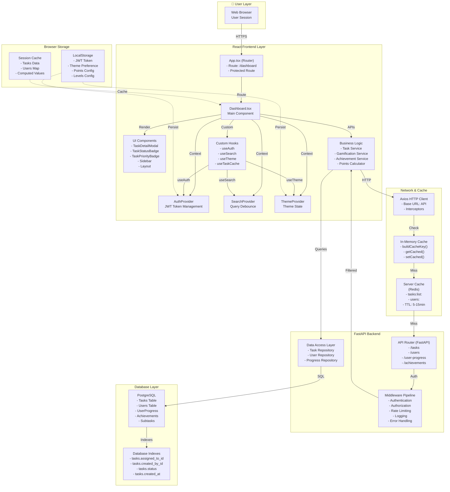

---

## 2. Detailed Component Rendering Flow

```mermaid
graph TD
    Start["Dashboard.tsx Mount"]
    
    Start -->|Step 1| EffectCheck["useEffect Synchronization<br/>Dependencies: [fetchDashboardData]"]
    
    EffectCheck -->|Step 2| FetchLogic["fetchDashboardData() Logic"]
    
    FetchLogic -->|Check| UserExists["user !== null?"]
    UserExists -->|No| Exit["Return Early"]
    UserExists -->|Yes| SetLoading["setLoading(true)"]
    
    SetLoading -->|Step 3| ParallelFetch["Promise.all([])"]
    ParallelFetch -->|API 1| GetTasksCall["api.getTasks(user.id, user.role)"]
    ParallelFetch -->|API 2| GetUsersCall["api.getUsers()"]
    
    GetTasksCall -->|HTTP| GetTasksAPI["GET /tasks?skip_overdue..."]
    GetUsersCall -->|HTTP| GetUsersAPI["GET /users"]
    
    GetTasksAPI -->|Cache Check| TasksCache["buildCacheKey<br/>tasks:{userId,role}"]
    TasksCache -->|HIT| ReturnCached["Return Cached[]"]
    TasksCache -->|MISS| QueryDB["Query DB<br/>Filter by role"]
    QueryDB -->|Return| SerializeData["Serialize TaskRead[]"]
    
    GetUsersAPI -->|Cache| UsersCache["buildCacheKey<br/>users"]
    UsersCache -->|Hit/Miss| ReturnUsers["User[]"]
    
    ReturnCached -->|Received| TransformTasks["Received in Frontend"]
    SerializeData -->|Received| TransformTasks
    ReturnUsers -->|Received| TransformUsers["Received in Frontend"]
    
    TransformTasks -->|Step 4| MapStep["mapTask()<br/>Transform ApiTask → Task<br/>- Parse dates<br/>- Map enums<br/>- Extract fields"]
    
    MapStep -->|Step 5| PointsStep["augmentTasksWithPoints()<br/>- Load Points Config<br/>- Calculate XP per task<br/>- Sum total XP"]
    
    PointsStep -->|Step 6| StateUpdate["Update State:<br/>setAllTasks(tasksWithPoints)<br/>setTasks(myTasks)<br/>setUsersMap(map)"]
    
    TransformUsers -->|Step 6| StateUpdate
    
    StateUpdate -->|Step 7| Rerender["Component Re-renders<br/>Component Lifecycle"]
    
    Rerender -->|Trigger| MemoCompute["Run useMemo Hooks"]
    
    MemoCompute -->|Compute 1| FilteredCalc["filteredTasks = useMemo<br/>Filter by search query<br/>- title, description, team<br/>- priority, status"]
    
    MemoCompute -->|Compute 2| FocusCalc["focusQueueTasks = useMemo<br/>Sort by creator role +<br/>priority + due date<br/>Slice top 5"]
    
    MemoCompute -->|Compute 3| StatusCalc["tasksByStatus = useMemo<br/>Group by status<br/>Reduce into object"]
    
    MemoCompute -->|Compute 4| StatsCalc["Statistics = useMemo<br/>- totalTasks<br/>- completedCount<br/>- focusCount<br/>- blockedCount<br/>- momentum%<br/>- streakLength"]
    
    MemoCompute -->|Compute 5| LevelCalc["levelProgressData = useMemo<br/>getLevelProgress(xpScore)<br/>- Current level<br/>- XP in level<br/>- Progress %<br/>- XP to next level"]
    
    FilteredCalc --> CalcComplete["All Computations Complete"]
    FocusCalc --> CalcComplete
    StatusCalc --> CalcComplete
    StatsCalc --> CalcComplete
    LevelCalc --> CalcComplete
    
    CalcComplete -->|Step 8| JSXBuild["JSX Build & Render"]
    
    JSXBuild -->|Render Section 1| HeroRender["Hero Section<br/>- Level Card<br/>- Momentum Card<br/>- Stats Grid 2x2<br/>- Animations triggered"]
    
    JSXBuild -->|Render Section 2| PipelineRender["Quest Pipeline Section<br/>- statusOrder.map() → StatusCard<br/>- Each shows top 3 tasks<br/>- Progress bars"]
    
    JSXBuild -->|Render Section 3| SidebarRender["Right Sidebar<br/>- Reporting Card<br/>- Focus Queue Card<br/>- Task items clickable"]
    
    JSXBuild -->|Render Section 4| ModalRender["Conditional Modal<br/>if (selectedTaskId)<br/>→ TaskDetailModal"]
    
    HeroRender --> DOMUpdate["Update DOM<br/>React Reconciliation"]
    PipelineRender --> DOMUpdate
    SidebarRender --> DOMUpdate
    ModalRender --> DOMUpdate
    
    DOMUpdate -->|Paint| Browser["Browser Paint<br/>- Layout<br/>- Paint<br/>- Composite"]
    
    Browser -->|Display| UserView["User Sees Dashboard<br/>with All Data"]
    
    UserView -->|Finally| SetLoadingFalse["setLoading(false)"]
    
    SetLoadingFalse --> Ready["Dashboard Ready<br/>for Interaction"]
```

---

## 3. State Management & Event Flow

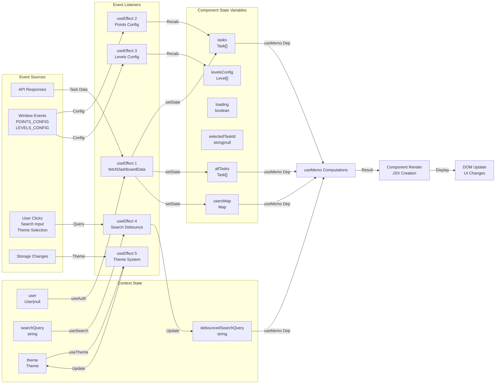

---

## 4. Data Transformation Pipeline

```mermaid
graph TD
    subgraph Input["Backend API Response"]
        Raw["GET /tasks Response<br/>⬇️<br/>JSON Array<br/>[TaskRead]"]
    end
    
    subgraph Step1["Step 1: HTTP + Cache"]
        Fetch["fetch via mockApi.ts<br/>- Axios GET request<br/>- Handle headers<br/>- Error mapping"]
        Cache1["Cache Check<br/>- buildCacheKey()<br/>- getCached()<br/>- Return if HIT"]
        Fetch -->|Cache MISS| APICall["Make HTTP Call<br/>GET /tasks"]
        APICall -->|Response| Serialize["Response arrives as<br/>JSON[]"]
        Serialize -->|Cache SET| Store["setCached(key, data)"]
    end
    
    subgraph Step2["Step 2: Data Mapping"]
        MapFunc["mapTask() Function<br/>Transform each item:<br/>ApiTask → Task<br/><br/>Conversions:<br/>- status: string → Enum<br/>- priority: string → Enum<br/>- dates: string → Date<br/>- assignedTo: id → id[]<br/>- Extract: pointsBreakdown"]
        RawArray["Raw API Array<br/>type: ApiTask[]"]
        MappedArray["Mapped Array<br/>type: Task[]"]
        RawArray -->|mapTask()| MapFunc
        MapFunc -->|Result| MappedArray
    end
    
    subgraph Step3["Step 3: Points Augmentation"]
        Config["Load Points Config<br/>from localStorage:<br/>- basePoints<br/>- priority multipliers<br/>- status bonuses<br/>- clarity multipliers"]
        AugFunc["augmentTasksWithPoints()<br/>For each Task:<br/>1. Calculate base points<br/>2. Apply priority * multiplier<br/>3. Apply clarity * multiplier<br/>4. Add to task object"]
        Augmented["Augmented Tasks<br/>Each task now has<br/>pointsBreakdown:<br/>- basePoints<br/>- priorityBonus<br/>- clarityBonus<br/>- totalPoints"]
        MappedArray -->|Points Config| Config
        Config -->|Execute| AugFunc
        AugFunc -->|Output| Augmented
    end
    
    subgraph Step4["Step 4: Filtering & Grouping"]
        Filter["Filter Logic:<br/>onlyMyTasks = ALL.filter(<br/>  task => assignedTo.includes(userId)<br/>)"]
        GroupLogic["Group by Status:<br/>tasksByStatus = tasks.reduce(<br/>  (acc, task) => {<br/>    acc[task.status].push(task)<br/>    return acc<br/>  }<br/>)"]
        Augmented -->|userId| Filter
        Filter -->|Filtered Array| MyTasks["My Tasks Array"]
        MyTasks -->|Status Key| GroupLogic
        GroupLogic -->|Result| StatusGroups["Tasks by Status<br/>Object<br/>{<br/>  'TODO': [Task, Task],<br/>  'IN_PROGRESS': [Task],<br/>  'DONE': [Task, Task, Task]<br/>}"]
    end
    
    subgraph Step5["Step 5: Memoized Computations"]
        Memo1["filteredTasks = useMemo<br/>Filter by debouncedSearchQuery<br/>- Match title<br/>- Match description<br/>- Match team<br/>Deps: [tasks, searched]"]
        Memo2["focusQueueTasks = useMemo<br/>- Filter: focusQueueStatusSet<br/>- Sort: creator role + priority + due<br/>- Slice: [0:5]<br/>Deps: [filteredTasks, usersMap]"]
        Memo3["tasksByStatus = useMemo<br/>Reduce filtered tasks<br/>by status<br/>Deps: [filteredTasks]"]
        Memo4["Statistics = useMemo<br/>- totalTasks = length<br/>- completedCount = count DONE|FAILED<br/>- focusCount = count in focusStatuses<br/>- blockedCount = count BLOCKED<br/>- momentum = (completed+focus)/total*100<br/>Deps: [filteredTasks]"]
        Memo5["levelProgressData = useMemo<br/>getLevelProgress(xpScore, config)<br/>- Current level<br/>- XP into level<br/>- Progress %<br/>- Points to next<br/>Deps: [xpScore, levelsConfig]"]
        
        MyTasks -->|Deps| Memo1
        Memo1 -->|Output| FilteredTasks["filteredTasks<br/>Searched & Filtered"]
        FilteredTasks -->|Deps| Memo2
        Memo2 -->|Output| FocusQueue["focusQueueTasks<br/>Top 5 Urgent"]
        FilteredTasks -->|Deps| Memo3
        Memo3 -->|Output| StatusGroups
        FilteredTasks -->|Deps| Memo4
        Memo4 -->|Output| Stats["Statistics<br/>Object"]
        
        Augmented -->|XP Calc| xpScore["xpScore<br/>= sum of all<br/>task points"]
        xpScore -->|Deps| Memo5
        Memo5 -->|Output| LevelData["levelProgressData<br/>Level, Progress, XP"]
    end
    
    subgraph Output["Ready for Render"]
        Ready["All data computed<br/>ready for JSX"]
    end
    
    Raw -->|Step 1| Serialize
    Serialize -->|Step 2| MappedArray
    Augmented -->|Step 3→4| MyTasks
    Stats -->|Step 5| Ready
    FocusQueue -->|Step 5| Ready
    LevelData -->|Step 5| Ready
```

---

## 5. Focus Queue Sorting Algorithm

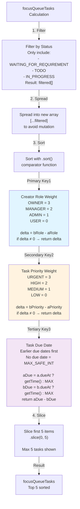

---

## 6. Theme Resolution System

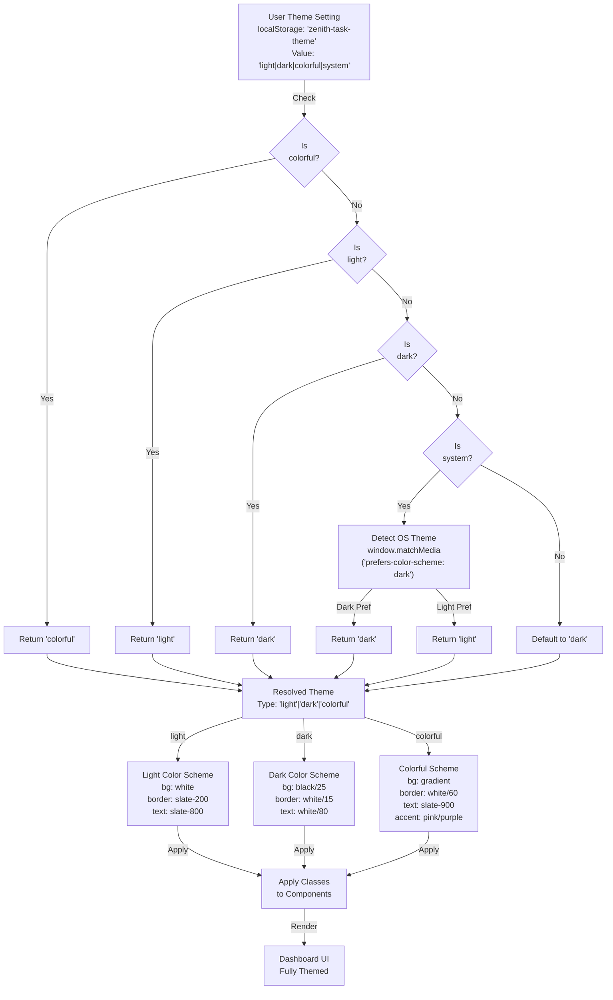

---

## 7. Task Lifecycle in Dashboard

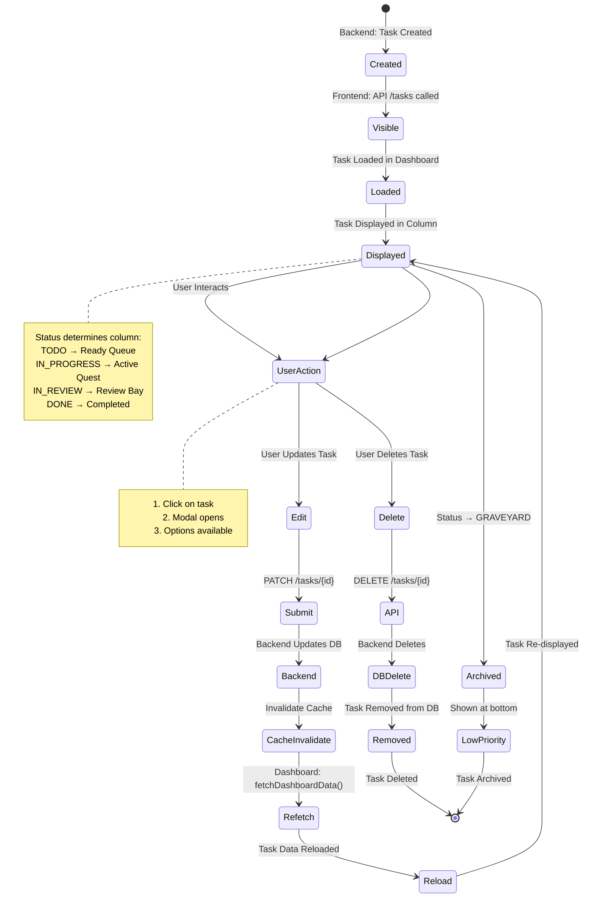


## 8. Performance Optimization Strategy

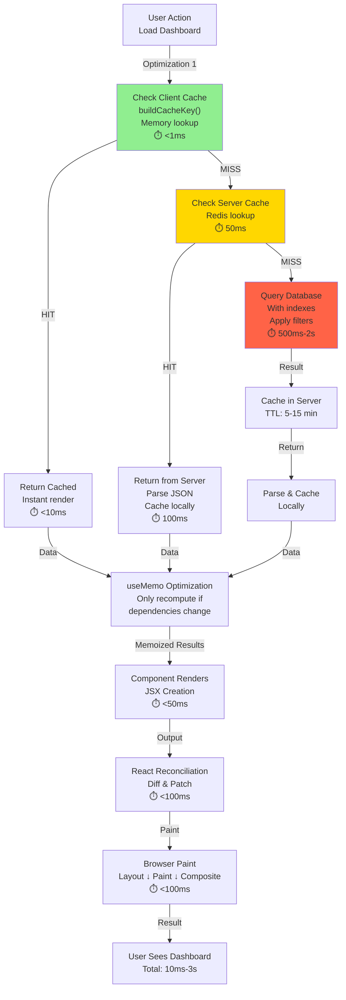

---

## 9. Component Render Tree with Props

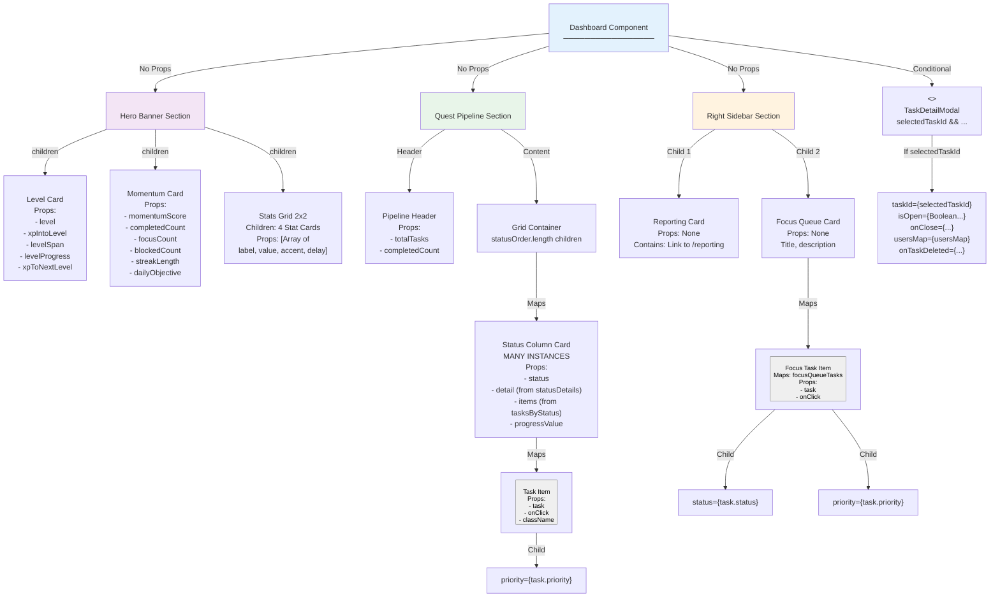

---

## 10. Data Dependency Graph

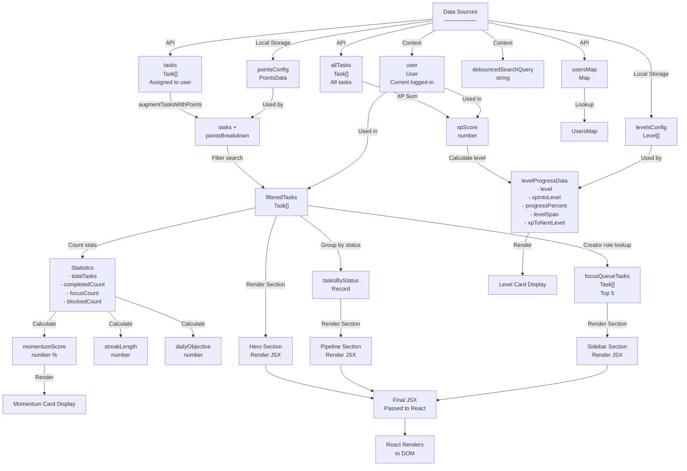

---

## 11. Error Handling Flow

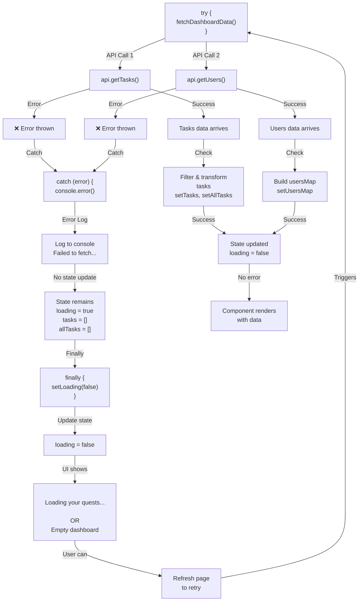

---

## 12. Search & Filter Pipeline

```
User Types in Search Bar
        ↓
SearchProvider captures input
        ↓
setSearchQuery(input)
        ↓ (300ms debounce timeout)
setDebouncedSearchQuery(query)
        ↓
Dashboard's useSearch() hook
returns { debouncedSearchQuery }
        ↓
useMemo dependency: [tasks, debouncedSearchQuery]
        ↓
Execute memoized calculation:
        ↓
if (!debouncedSearchQuery) return tasks
        ↓
const query = debouncedSearchQuery.toLowerCase()
        ↓
return tasks.filter(task => {
  const label = priorityLabel[task.priority]
  
  return (
    task.title.toLowerCase().includes(query) OR
    task.description.toLowerCase().includes(query) OR
    task.team.toLowerCase().includes(query) OR
    task.priority.toLowerCase().includes(query) OR
    label.toLowerCase().includes(query)
  )
})
        ↓
filteredTasks = result
        ↓
focusQueueTasks, tasksByStatus,
statistics, all recalculate
        ↓
Component re-renders
        ↓
User sees filtered results
```

---

## 13. Task Status Column Distribution

```
┌──────────────────────────────────────────────────────────────┐
│              Quest Pipeline - 9 Status Columns               │
├──────────────────────────────────────────────────────────────┤
│                                                              │
│  Column 1: WAITING_FOR_REQUIREMENT                          │
│  ├─ Legend: "Gather intel"                                  │
│  ├─ Color: from-slate-500/25 via-slate-600/25              │
│  ├─ Glow: shadow-slate                                      │
│  ├─ Show: First 3 tasks                                     │
│  └─ Badge: [Count] quest(s)                                 │
│                                                              │
│  Column 2: TODO                                             │
│  ├─ Legend: "Prep to launch"                                │
│  ├─ Color: from-indigo-500/25 via-sky-500/25               │
│  ├─ Glow: shadow-blue                                       │
│  └─ Show: First 3 tasks                                     │
│                                                              │
│  Column 3: IN_PROGRESS                                      │
│  ├─ Legend: "Stay in the zone"                              │
│  ├─ Color: from-purple-500/25 via-fuchsia-500/25           │
│  ├─ Glow: shadow-purple                                     │
│  └─ Show: First 3 tasks                                     │
│                                                              │
│  Column 4: IN_REVIEW                                        │
│  ├─ Legend: "Awaiting verdict"                              │
│  ├─ Color: from-emerald-500/25 via-teal-500/25             │
│  ├─ Glow: shadow-teal                                       │
│  └─ Show: First 3 tasks                                     │
│                                                              │
│  Column 5: BLOCKED                                          │
│  ├─ Legend: "Needs assistance"                              │
│  ├─ Color: from-rose-500/25 via-red-500/25                 │
│  ├─ Glow: shadow-red                                        │
│  └─ Show: First 3 tasks                                     │
│                                                              │
│  Column 6: ON_HOLD                                          │
│  ├─ Legend: "Resume later"                                  │
│  ├─ Color: from-slate-400/25 via-slate-500/25              │
│  ├─ Glow: shadow-gray                                       │
│  └─ Show: First 3 tasks                                     │
│                                                              │
│  Column 7: DONE                                             │
│  ├─ Legend: "Claim your XP"                                 │
│  ├─ Color: from-emerald-400/25 via-lime-400/25             │
│  ├─ Glow: shadow-green                                      │
│  └─ Show: First 3 tasks                                     │
│                                                              │
│  Column 8: FAILED                                           │
│  ├─ Legend: "Mission failed"                                │
│  ├─ Color: from-cyan-400/25 via-emerald-400/25             │
│  ├─ Glow: shadow-cyan                                       │
│  └─ Show: First 3 tasks                                     │
│                                                              │
│  Column 9: GRAVEYARD                                        │
│  ├─ Legend: "Archived quests"                               │
│  ├─ Color: from-gray-400/25 via-gray-500/25                │
│  ├─ Glow: shadow-gray                                       │
│  └─ Show: First 3 tasks                                     │
│                                                              │
│  Note: Only columns with tasks are rendered                 │
│        statusOrder.filter(status => tasksByStatus[status]?.length)
│                                                              │
└──────────────────────────────────────────────────────────────┘
```

---

## 14. Browser Cache Key Generation

```
buildCacheKey() Algorithm:

Function: buildCacheKey(resource, { userId, role }) → string

Steps:
1. Combine inputs:
   - settings.cache_prefix = "zea:"
   - resource = "tasks"
   - tenant_id = user.tenant_id or default
   - user_id = userId
   - path = request.url.path
   - params = request.query_params

2. Hash fingerprint:
   fingerprint = SHA256(JSON.stringify(params))

3. Build key:
   key = `${cache_prefix}:${resource}:tenant:${tenant_id}:user:${user_id}:q:${fingerprint}`

Example:
   Prefix:        zea
   Resource:      tasks:list
   Tenant:        tenant-123
   User:          user-456
   Hash:          a1b2c3d4...
   ─────────────────────────────────────────────
   Final Key:     zea:tasks:list:tenant:tenant-123:user:user-456:q:a1b2c3d4...

Frontend Implementation:
   const cacheKey = buildCacheKey('tasks', { userId: user.id, role: user.role })
   const cached = getCached<Task[]>(cacheKey)
   if (cached) return cached
   
   // Make HTTP call
   const { data } = await http.get<ApiTask[]>('/tasks')
   
   // Cache result
   setCached(cacheKey, data)
   
   return data
```

---

## 15. Real-time Sync Opportunities

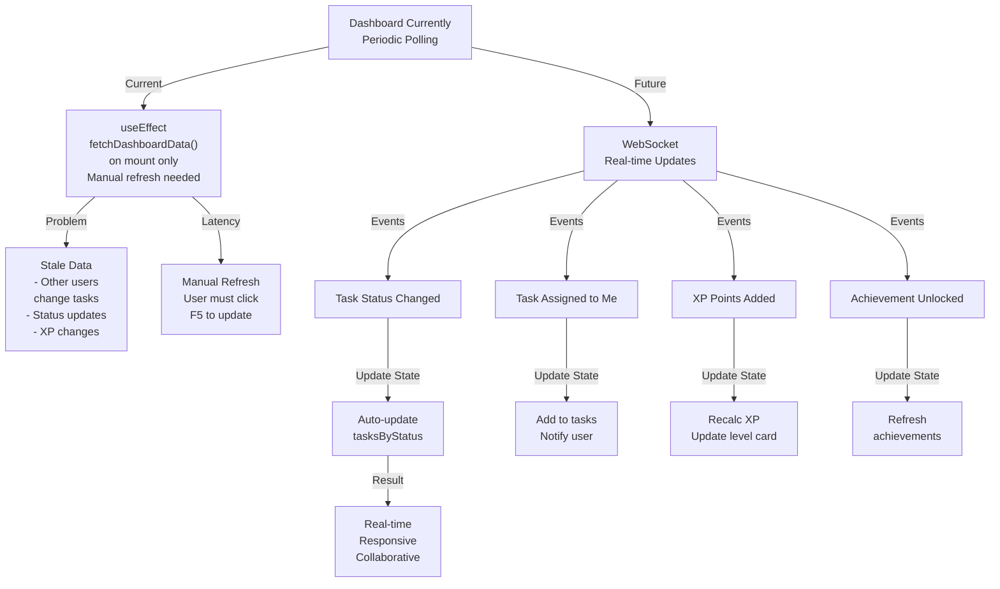

---

**End of Advanced Architectu Diagrams Report**
