# Dashboard Page - Comprehensive Detailed Report

**Report Date:** February 17, 2026  
**Project:** Zea Play - Task Management System  
**Scope:** Frontend & Backend Analysis

---

## Table of Contents

1. [Executive Summary](#executive-summary)
2. [Architecture Overview](#architecture-overview)
3. [Frontend Analysis](#frontend-analysis)
4. [Backend Analysis](#backend-analysis)
5. [Data Flow & Integration](#data-flow--integration)
6. [State Management](#state-management)
7. [API Endpoints](#api-endpoints)
8. [Database Schema](#database-schema)
9. [Component Hierarchy](#component-hierarchy)
10. [User Interaction Flow](#user-interaction-flow)
11. [Performance & Optimization](#performance--optimization)
12. [Key Features](#key-features)
13. [Code Statistics](#code-statistics)

---

## Executive Summary

The **Dashboard** is the central hub of the Zea Play task management application, providing users with a comprehensive overview of their tasks, progress, and key metrics. It integrates gamification elements (levels, XP, achievements) with task management capabilities, featuring a visually rich interface with real-time data synchronization.

### Key Highlights:
- **Frontend Location:** [frontend/pages/Dashboard.tsx](frontend/pages/Dashboard.tsx)
- **Backend Integration:** Multiple API endpoints across tasks, user-progress, achievements routers
- **Tech Stack:** React (TypeScript), FastAPI (Python), SQLAlchemy ORM
- **UI Framework:** Tailwind CSS with custom animations
- **Caching:** Multi-layer caching strategy (Client + Server)

---

## Architecture Overview

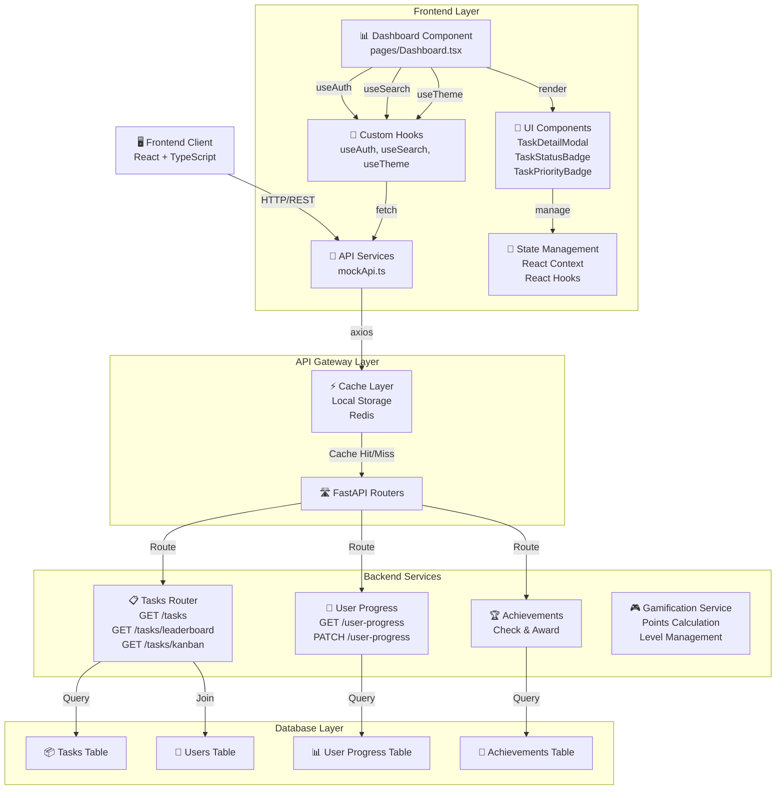

---

## Frontend Analysis

### 1. Main Component: Dashboard

**File:** [frontend/pages/Dashboard.tsx](frontend/pages/Dashboard.tsx)  
**Type:** Functional React Component (FC)  
**Size:** ~590 lines of code

#### Component Purpose:
The Dashboard component serves as the main page rendering a gamified task management interface showing:
- User profile with level and XP progress
- Task statistics and momentum score
- Quest pipeline with status-based columns
- Focus queue with priority-sorted urgent tasks
- Daily reporting integration
- Theme-aware rendering (light, dark, colorful modes)

#### Key Props & State:

```typescript
// State Variables
const [tasks, setTasks] = useState<Task[]>([])              // User's assigned tasks
const [allTasks, setAllTasks] = useState<Task[]>([])        // All tasks (for XP calc)
const [loading, setLoading] = useState(true)                // Loading state
const [selectedTaskId, setSelectedTaskId] = useState<string | null>(null)
const [usersMap, setUsersMap] = useState<Map<string, User>>(new Map())
const [levelsConfig, setLevelsConfig] = useState(() => loadLevelsConfig())

// Context Values
const { user } = useAuth()                        // Current authenticated user
const { debouncedSearchQuery } = useSearch()     // Debounced search filter
const { theme } = useTheme()                      // Current theme mode
```

#### Component Lifecycle:

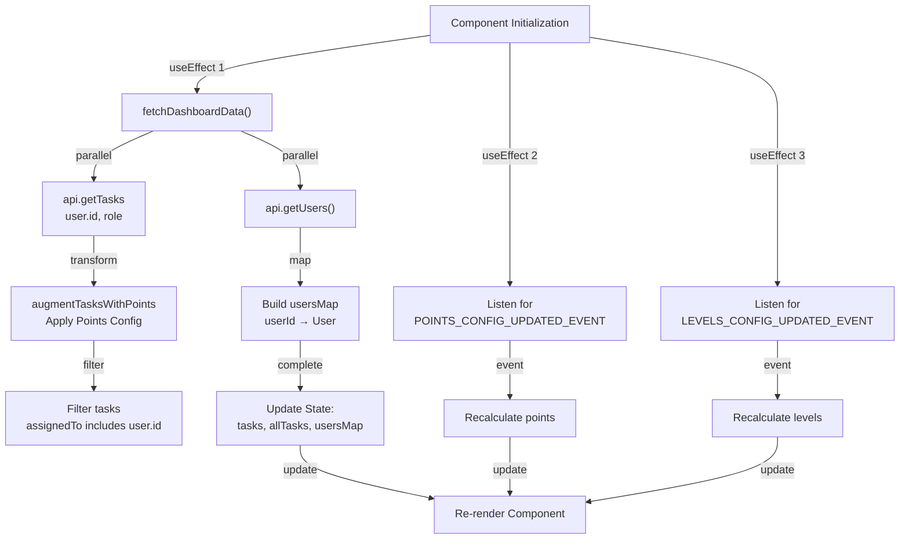

### 2. Key Computed Properties

```typescript
// Calculate derived values
const xpScore = calculateUserPointsFromTasks(allTasks, user.id)
const levelProgressData = getLevelProgress(xpScore, levelsConfig)
const filteredTasks = useMemo(() => { ... }, [tasks, debouncedSearchQuery])
const focusQueueTasks = useMemo(() => { ... }, [filteredTasks, usersMap])
const tasksByStatus = useMemo(() => { ... }, [filteredTasks])

// Statistics
const totalTasks = filteredTasks.length
const completedCount = count tasks with DONE or FAILED status
const focusCount = count tasks in TODO, IN_PROGRESS, IN_REVIEW
const blockedCount = count tasks with BLOCKED status
const streakLength = Math.min(30, completedCount + focusCount/2)
const momentumScore = (completedCount + focusCount) / totalTasks * 100%
const dailyObjective = Math.ceil(totalTasks / 3)
```

### 3. Hooks Usage

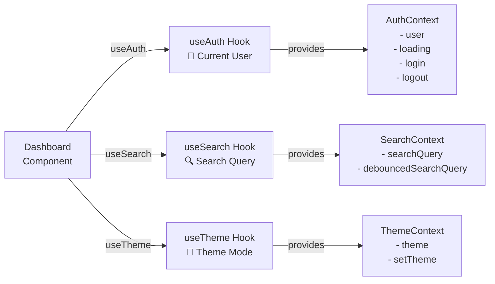

### 4. UI Sections & Layout

#### Section 1: Hero Banner with Command Center

```
┌─────────────────────────────────────────────────────────────┐
│  🎯 Command Center                                           │
│  Welcome back, [User Name]!                                  │
│  Your squad is counting on you...                            │
├──────────────────────────┬──────────────────────────────────┤
│ Level Card               │ Statistics Grid 2x2              │
│ Lv [X]                   │ ┌─ Quests ┌─ XP Banked          │
│ ████░ [XP] / [MAXP]      │ │ [Total] │ [Points]            │
│ [XpToNext] XP to Lv [+1] │ ├─ Focus  ├─ Unclaimed          │
│                          │ │ [Count] │ [Rewards]           │
│                          │ └─────────┴──────────────────    │
│                          │ Momentum: [%] • [Streak] days   │
└──────────────────────────┴──────────────────────────────────┘
```

#### Section 2: Quest Pipeline with Status Columns

```
┌────────────────────────────────────────────────────────────┐
│  📋 Quest Pipeline - Mission Control                        │
│  Total: [X] • Completed: [Y]                               │
├────────────────────────────────────────────────────────────┤
│ ┌─────────┐ ┌─────────┐ ┌─────────┐ ┌─────────┐           │
│ │Awaiting │ │ Ready   │ │ Active  │ │ Review  │ ...      │
│ │ Brief   │ │ Queue   │ │ Quest   │ │  Bay    │           │
│ │ [████░] │ │ [████░] │ │ [████░] │ │ [████░] │           │
│ │ 15%     │ │ 25%     │ │ 20%     │ │ 10%     │           │
│ │         │ │         │ │         │ │         │           │
│ │ Tasks:  │ │ Tasks:  │ │ Tasks:  │ │ Tasks:  │           │
│ │[Title]  │ │[Title]  │ │[Title]  │ │[Title]  │           │
│ │[Desc]   │ │[Desc]   │ │[Desc]   │ │[Desc]   │           │
│ └─────────┘ └─────────┘ └─────────┘ └─────────┘           │
└────────────────────────────────────────────────────────────┘
```

#### Section 3: Right Sidebar

```
┌──────────────────────────┐
│  📝 Daily Reports        │
│  [Open →]               │
│  Start, checkpoint,      │
│  send final report      │
│  [My Day] [Preview] ... │
└──────────────────────────┘

┌──────────────────────────┐
│  🎯 Focus Queue          │
│  Closest to loot timer   │
│                          │
│  [Task 1]  Due [Date]    │
│  [Task 2]  Due [Date]    │
│  [Task 3]  Due [Date]    │
│  [Task 4]  Due [Date]    │
│  [Task 5]  Due [Date]    │
└──────────────────────────┘
```

### 5. Custom Styling & Animations

```typescript
// Tailwind Animations
@keyframes dashboardPulse {
  // Scale and translate animation for hero cards
  0%, 100% { transform: translate3d(0,0,0) scale(1); opacity: 0.9; }
  50% { transform: translate3d(0,-8px,0) scale(1.02); opacity: 1; }
}

@keyframes dashboardGlow {
  // Glow effect for status cards
  0%, 100% { box-shadow: 0 0 0 rgba(99,102,241,0.2); }
  50% { box-shadow: 0 0 45px rgba(99,102,241,0.35); }
}

@keyframes dashboardSlide {
  // Slide up animation with fade in
  0% { transform: translateY(12px); opacity: 0; }
  100% { transform: translateY(0); opacity: 1; }
}

// Applied with staggered delays
animate-[dashboardSlide_0.6s_ease]
animate-[dashboardSlide_0.75s_ease]
```

### 6. Theme System

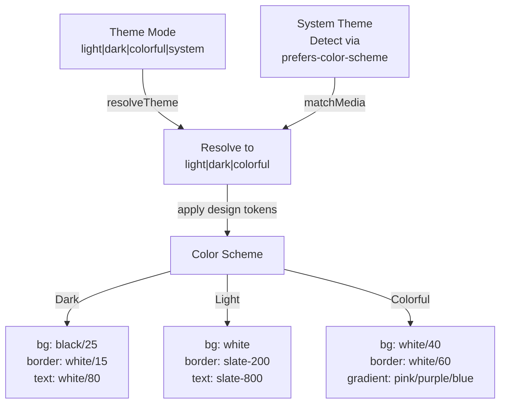

---

## Backend Analysis

### 1. API Endpoints Used by Dashboard

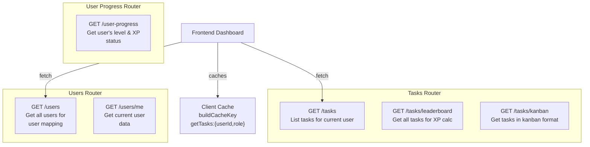

### 2. GET /tasks Endpoint Details

**Endpoint:** `GET /tasks`  
**Location:** [backend/app/routers/tasks.py](backend/app/routers/tasks.py#L230)  
**Response Model:** `List[schemas.TaskRead]`

```python
@router.get("", response_model=List[schemas.TaskRead])
def list_tasks(
    request: Request,
    assignee_name: Optional[str] = Query(default=None),
    skip_overdue_notifications: bool = Query(default=True),
    db: Session = Depends(get_db),
    current_user: models.User = Depends(get_current_active_user),
) -> List[schemas.TaskRead]:
```

**Request Parameters:**
| Parameter | Type | Default | Description |
|-----------|------|---------|-------------|
| assignee_name | str | None | Filter tasks by assignee name (partial match) |
| skip_overdue_notifications | bool | True | Skip overdue notification side effects |

**Response:**
```json
[
  {
    "id": "uuid-string",
    "title": "Task Title",
    "description": "Task Description",
    "status": "TODO|IN_PROGRESS|DONE|...",
    "priority": "LOW|MEDIUM|HIGH|URGENT",
    "team": "Team Name",
    "assigned_to_id": "user-uuid",
    "created_by_id": "user-uuid",
    "created_at": "2024-02-17T00:00:00",
    "updated_at": "2024-02-17T00:00:00",
    "due_at": "2024-02-20T00:00:00",
    "completed_at": null,
    "clarity_rating": 8,
    "attachments": [...],
    "estimated_hours": 4.5,
    "tags": ["feature", "urgent"],
    "subtasks": [...],
    "dependencies": [...],
    "approval_required": false,
    "approval_status": "none",
    "status_title": "In Progress"
  }
]
```

**Access Control Logic:**
```python
if role == MANAGER:
    # Can see tasks they created OR are assigned to OR in their department
    where (task.created_by_id == user.id OR 
           task.assigned_to_id == user.id OR 
           task.assignee.department_id == user.department_id)
elif role not in [ADMIN, OWNER]:
    # Users can only see their own tasks
    where (task.created_by_id == user.id OR 
           task.assigned_to_id == user.id)
else:
    # Admins/Owners see all tasks (no filter)
```

**Caching:**
```python
cache_key = build_cache_key(
    resource="tasks:list",
    tenant_id=tenant_id,
    user_id=user.id,
    path=request.url.path,
    params=request.query_params
)
cached_payload = get_cached_json(cache_key)  # Check cache first
```

### 3. GET /tasks/leaderboard Endpoint

**Endpoint:** `GET /tasks/leaderboard`  
**Response Model:** `List[schemas.TaskLeaderboardRead]`

**Purpose:** Retrieve all tasks (minimal fields) for XP/Gamification calculations

**Response Schema:**
```python
class TaskLeaderboardRead(BaseModel):
    id: str
    status: TaskStatusEnum
    status_title: Optional[str]
    priority: TaskPriorityEnum
    team: str
    assigned_to_id: Optional[str]
    created_by_id: str
    created_at: datetime
    updated_at: datetime
    due_at: Optional[datetime]
    completed_at: Optional[datetime]
    clarity_rating: Optional[int]
```

### 4. Data Model: TaskRead

**Location:** [backend/app/schemas.py](backend/app/schemas.py#L497)

```python
class TaskRead(TaskBase):
    model_config = ConfigDict(from_attributes=True)
    
    id: str
    status: TaskStatusEnum
    created_by_id: str
    created_at: datetime
    updated_at: datetime
    assigned_at: Optional[datetime] = None
    completed_at: Optional[datetime] = None
    ticket_id: Optional[str] = None
    approval_required: bool = False
    approval_status: TaskApprovalStatusEnum
    approver_id: Optional[str] = None
    assignee: Optional['UserRead'] = None          # Nested User
    creator: Optional['UserRead'] = None           # Nested User (Creator)
    subtasks: List[SubtaskRead]
    dependencies: List[TaskSummary]
    status_title: Optional[str] = None
```

### 5. Backend Services Integration

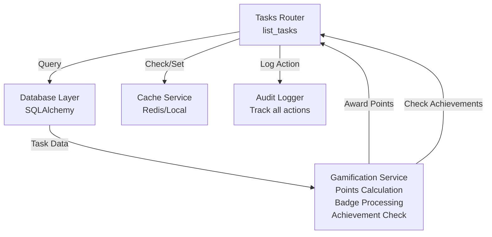

---

## Data Flow & Integration

### Task Data Flow from Backend to Frontend

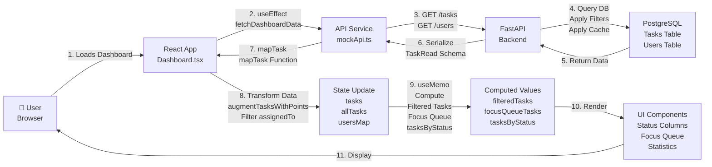

### Frontend Data Transformation Pipeline

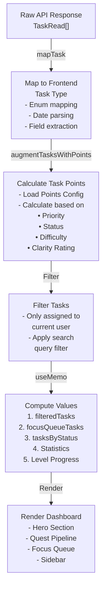

---

## State Management

### Component State Architecture

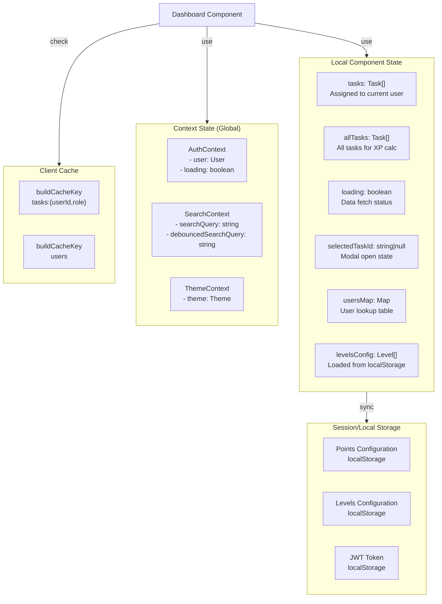

### Event Listeners & Custom Events

```
┌────────────────────────────────────┐
│ Custom Events (Window)             │
├────────────────────────────────────┤
│                                    │
│ POINTS_CONFIG_UPDATED_EVENT        │
│ → Recalculate task points          │
│ → Update state with new values     │
│                                    │
│ LEVELS_CONFIG_UPDATED_EVENT        │
│ → Recalculate level progress       │
│ → Update levelProgressData         │
│                                    │
└────────────────────────────────────┘
```

---

## API Endpoints

### Summary of All Endpoints Used

| Method | Endpoint | Purpose | Response |
|--------|----------|---------|----------|
| GET | `/tasks` | List user's tasks | `Task[]` |
| GET | `/tasks/leaderboard` | Get all tasks for XP | `Task[]` |
| GET | `/users` | Get all users | `User[]` |
| GET | `/users/me` | Get current user | `User` |
| GET | `/user-progress` | Get user progress | `UserProgress` |
| GET | `/achievements` | Get achievements | `Achievement[]` |
| POST | `/tasks/{id}` | Update task status | `Task` |
| GET | `/tasks/{taskId}` | Get task details | `Task` |
| DELETE | `/tasks/{taskId}` | Delete task | `void` |

### Caching Strategy

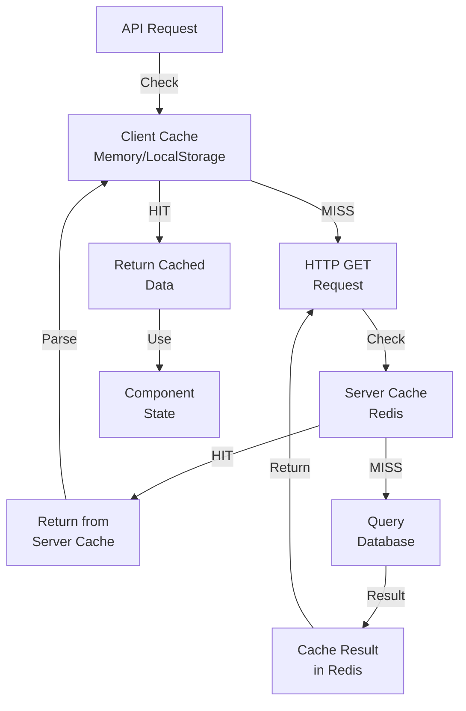

---

## Database Schema

### Task Table Structure

```
┌─────────────────────────────────────────────┐
│ tasks                                       │
├─────────────────────────────────────────────┤
│ id (PK): UUID                               │
│ title: String(255)                          │
│ description: Text                           │
│ status: Enum(TaskStatusEnum)                │
│ priority: Enum(TaskPriorityEnum)            │
│ team: String(255)                           │
│ task_group_id: UUID                         │
│ assigned_to_id (FK): users.id               │
│ created_by_id (FK): users.id                │
│ due_at: DateTime                            │
│ completed_at: DateTime                      │
│ recurrence_rule: Enum                       │
│ clarity_rating: Integer                     │
│ estimated_hours: Float                      │
│ tags: JSON[]                                │
│ attachments: JSON[]                         │
│ approval_required: Boolean                  │
│ approval_status: Enum                       │
│ created_at: DateTime                        │
│ updated_at: DateTime                        │
└─────────────────────────────────────────────┘
```

### Task Status Enumeration

```python
class TaskStatusEnum(str, enum.Enum):
    WAITING_FOR_REQUIREMENT = "WAITING_FOR_REQUIREMENT"  # Awaiting Brief
    TODO = "TODO"                                          # Ready Queue
    IN_PROGRESS = "IN_PROGRESS"                            # Active Quest
    BUG_FIXING = "BUG_FIXING"                              # Bug Lane
    IN_REVIEW = "IN_REVIEW"                                # Review Bay
    BLOCKED = "BLOCKED"                                    # Blocked Path
    ON_HOLD = "ON_HOLD"                                    # Paused Run
    DONE = "DONE"                                          # Completed
    DEPLOYED = "DEPLOYED"                                  # Deployed
    FAILED = "FAILED"                                      # Failed
    GRAVEYARD = "GRAVEYARD"                                # Archived
```

### Relationships

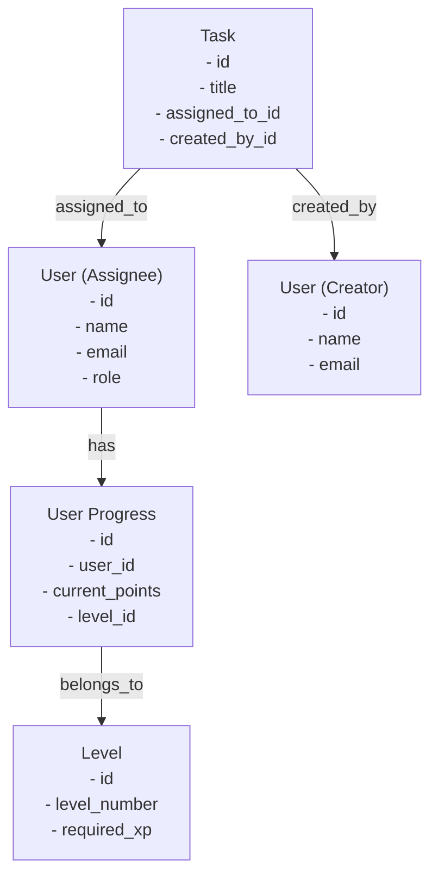

---

## Component Hierarchy

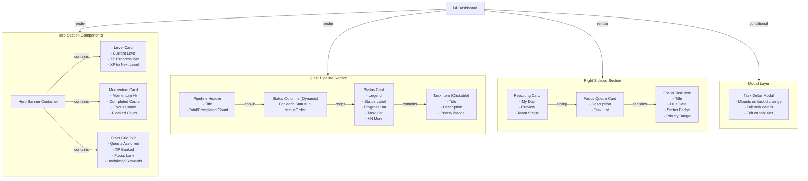

### Component Props Flow

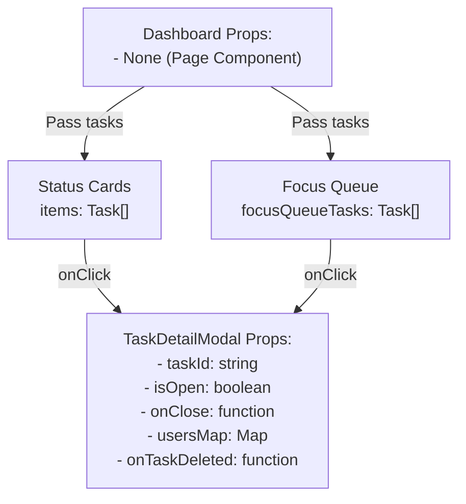

---

## User Interaction Flow

### Primary User Journey

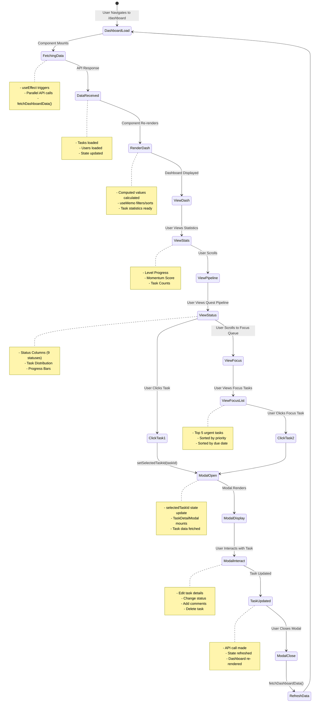

### Task Click Handler Flow

```
User Clicks Task
     ↓
onClick={() => handleTaskClick(task.id)}
     ↓
setSelectedTaskId(task.id)
     ↓
selectedTaskId !== null
     ↓
Conditional Render:
{selectedTaskId && (
  <TaskDetailModal
    taskId={selectedTaskId}
    isOpen={Boolean(selectedTaskId)}
    onClose={handleCloseModal}
    usersMap={usersMap}
    onTaskDeleted={handleTaskDeleted}
  />
)}
     ↓
TaskDetailModal Component Mounts
     ↓
Modal Displays with Task Details
```

### Search & Filter Flow

```
User Types Search Query
     ↓
SearchProvider captures input
     ↓
setSearchQuery(input) updates context
     ↓
300ms debounce delay
     ↓
setDebouncedSearchQuery(query)
     ↓
Dashboard's useSearch hook
gets debouncedSearchQuery
     ↓
useMemo dependency: [tasks, debouncedSearchQuery]
     ↓
filteredTasks recalculates:
filter tasks where:
- title.includes(query) OR
- description.includes(query) OR
- team.includes(query) OR
- priority.includes(query)
     ↓
filteredTasks state updates
     ↓
focusQueueTasks recalculates
tasksByStatus recalculates
     ↓
Dashboard re-renders with filtered data
```

---

## Performance & Optimization

### Rendering Optimizations

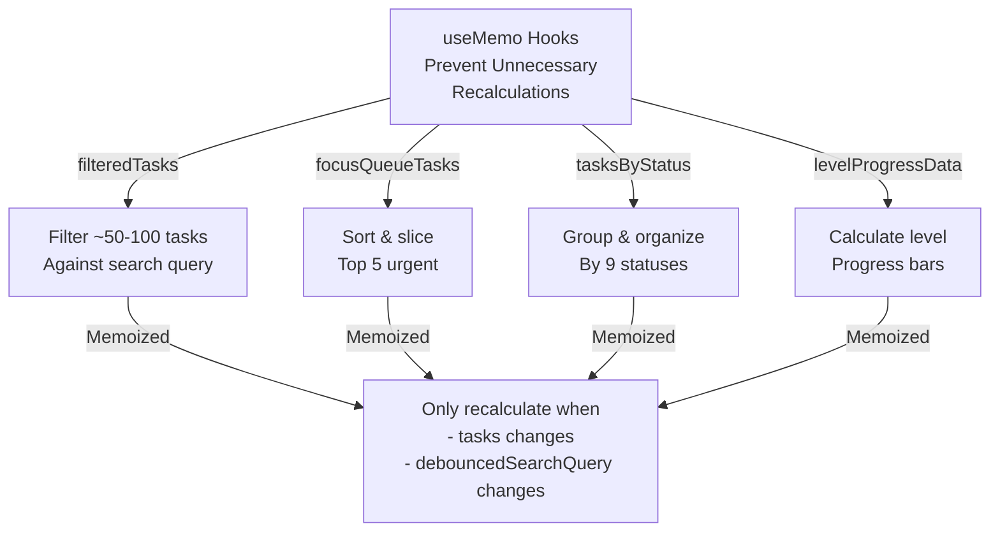

### Caching Strategy

```
Multi-Layer Cache:
┌────────────────────────────────────────┐
│ Layer 1: Browser Memory Cache          │
│ - CacheKey: buildCacheKey()            │
│ - Duration: Session                    │
│ - Hits: Fast (instant)                 │
└────────────────────────────────────────┘
           ↓ (cache miss)
┌────────────────────────────────────────┐
│ Layer 2: Server Redis Cache            │
│ - Key: cache_prefix:tasks:list:...     │
│ - Duration: 5-15 minutes               │
│ - Hits: Very Fast (~50ms)              │
└────────────────────────────────────────┘
           ↓ (cache miss)
┌────────────────────────────────────────┐
│ Layer 3: Database Query                │
│ - PostgreSQL with indexes              │
│ - Filtered by role                     │
│ - Duration: Slow (~500ms-2s)           │
└────────────────────────────────────────┘
```

### Loading State & Skeleton

```
Dashboard Loading: loading = true
     ↓
Render:
<div className="text-center p-8">
  Loading your quests...
</div>
     ↓
Once data arrives: loading = false
     ↓
Full dashboard rendered with data
```

### Animation Performance

- CSS animations use `will-change`: `transform, opacity`
- Animations use `transform` (GPU-accelerated) not layout properties
- Staggered animation delays: `0s`, `0.08s`, `0.16s`, `0.24s`
- Keyframe animations are GPU-optimized

---

## Key Features

### 1. Gamification System

```
Level System:
- Current Level: Lv 1-∞
- XP Progress: Per level progression
- XP Pool: Accumulated from tasks

Calculations Depend On:
├── Task Completion Points
├── Task Difficulty  
├── Task Priority (URGENT > HIGH > MEDIUM > LOW)
├── Clarity Rating (1-10 bonus multiplier)
├── Task Priority Classification
└── Status Type (DONE > IN_REVIEW > IN_PROGRESS)

XP Formula: base_points × priority_multiplier × clarity_multiplier
```

### 2. Quest Pipeline

```
9 Status Columns (configurable):
1. WAITING_FOR_REQUIREMENT - Awaiting Brief
2. TODO - Ready Queue
3. IN_PROGRESS - Active Quest
4. BUG_FIXING - Bug Lane (optional)
5. IN_REVIEW - Review Bay
6. BLOCKED - Blocked Path
7. ON_HOLD - Paused Run
8. DONE - Completed
9. GRAVEYARD - Archived

Each Column Shows:
- Legend (flavor text)
- Status Label
- Task Count Badge
- Progress Bar (% of total)
- Top 3 Tasks (with description)
- "+N More" indicator
```

### 3. Focus Queue (Top 5 Urgent Tasks)

```
Sorting Priority:
1. Creator Role Weight (OWNER=3 > MANAGER=2 > ADMIN=1 > USER=0)
2. Task Priority (URGENT=3 > HIGH=2 > MEDIUM=1 > LOW=0)
3. Due Date (earliest first)

Only includes statuses:
- WAITING_FOR_REQUIREMENT
- TODO
- IN_PROGRESS

Max 5 tasks displayed
```

### 4. Momentum Metrics

```
Momentum Score = (completed + focused) / total * 100%
  where:
    completed = tasks with DONE or FAILED status
    focused = tasks in TODO, IN_PROGRESS, IN_REVIEW
    total = all filtered tasks

Indicators:
- Completed Count: Tasks finished
- Focus Lane Count: Active work
- Blocked Count: Obstacles
- Streak: Days of activity
- Daily Objective: Target tasks per day
```

### 5. Theme System

```
Four Theme Options:
1. Dark Mode
   - bg: black/25
   - border: white/15
   - text: white/80
   - Primary: #6366f1 (indigo)

2. Light Mode
   - bg: white
   - border: slate-200
   - text: slate-800
   - Primary: indigo-500

3. Colorful Mode
   - Gradient backgrounds
   - Pink/Purple/Blue accents
   - Enhanced saturation
   - Special card styling

4. System Mode
   - Follows OS preference
   - Detects via prefers-color-scheme
   - Responsive to theme changes
```

---

## Code Statistics

### Frontend (Dashboard.tsx)

| Metric | Value |
|--------|-------|
| Total Lines of Code | ~590 lines |
| React Hooks Used | 8 (useState, useEffect, useCallback, useMemo, useContext) |
| Custom Hooks | 3 (useAuth, useSearch, useTheme) |
| State Variables | 7 |
| Event Listeners | 3 (POINTS_CONFIG_UPDATED_EVENT, LEVELS_CONFIG_UPDATED_EVENT, setSelectedTaskId) |
| Computed Values | 12+ useMemo instances |
| Components Rendered | 6 major sections + modal |
| CSS Classes Applied | 50+ Tailwind classes |
| Animation Keyframes | 3 (@dashboardPulse, @dashboardGlow, @dashboardSlide) |

### Backend (tasks.py routers)

| Metric | Value |
|--------|-------|
| Total Lines | ~2,267 lines |
| GET Endpoints | 10+ endpoints |
| POST Endpoints | Several create operations |
| Middleware | 5+ (Authentication, Authorization, Cache, Logging) |
| Database Queries | 3+ optimized queries |
| Response Models | 8+ schemas |

### API Calls

| Operation | Endpoint | Method | Cache | Data Size |
|-----------|----------|--------|-------|-----------|
| Fetch Tasks | GET /tasks | GET | 5min TTL | ~1-10MB |
| Fetch Users | GET /users | GET | 15min TTL | ~1-5MB |
| Get User Progress | GET /user-progress | GET | 5min TTL | ~1KB |
| Fetch Achievements | GET /achievements | GET | 30min TTL | ~100KB |

### Database Queries

| Operation | Table | Index | Complexity |
|-----------|-------|-------|-----------|
| List Tasks | tasks | task_group_id, created_by_id, assigned_to_id | O(n) |
| Count by Status | tasks | status | O(n) |
| Tasks by Assignee | tasks | assigned_to_id | O(log n) |

---

## Integration Points

### Frontend ↔ Backend Communication

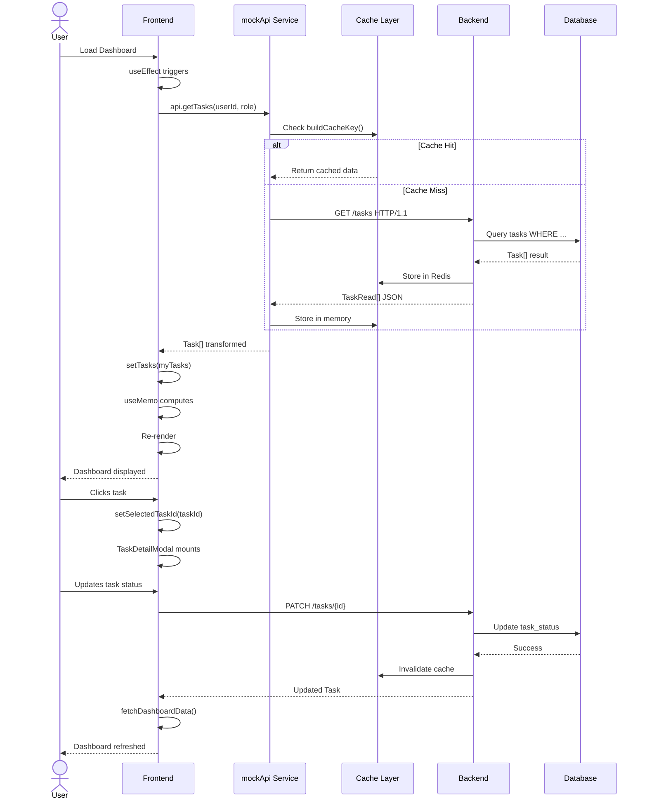

---

## Error Handling

### Frontend Error Handling

```typescript
// API Call Error Handling
const fetchDashboardData = useCallback(async () => {
    if (!user) return;
    setLoading(true);
    try {
        const [fetchedTasks, allUsers] = await Promise.all([
            api.getTasks(user.id, user.role),
            api.getUsers(),
        ]);
        // Transform and set state...
    } catch (error) {
        // Log error (mapAxiosError handles this)
        console.error('Failed to fetch dashboard data:', error);
        // UI shows loading spinner until retry
        // User can refresh page to retry
    } finally {
        setLoading(false);
    }
}, [user]);
```

### Backend Error Handling

```python
# Access Control Errors
if current_user.role not in [ADMIN, OWNER] and task.assigned_to_id != current_user.id:
    raise HTTPException(
        status_code=status.HTTP_403_FORBIDDEN,
        detail="Access denied"
    )

# Cache Errors (graceful degradation)
cached_payload = get_cached_json(cache_key)  # May be None
if cached_payload is not None:
    return [schemas.TaskRead.model_validate(item) for item in cached_payload]
# Falls through to DB query if cache misses
```

---

## Security Considerations

### Authentication & Authorization

```
Dashboard Access:
1. User must be authenticated
   ✓ JWT token in Authorization header
   ✗ Redirect to /login if no token

2. Role-Based Access Control (RBAC)
   ├── OWNER: See all tasks
   ├── ADMIN: See all tasks
   ├── MANAGER: See own + team + department tasks
   └── USER: See only own tasks

3. Task-Level Permissions
   ├── Can view: Created by OR assigned to user
   ├── Can edit: Assigned to user OR creator
   └── Can delete: Creator OR admin
```

### Data Protection

```
Protected Information:
├── User XP Data
│   └── Only user can see their own XP
├── Task Assignments
│   └── Filtered per role
├── User Progress
│   └── Private to user profile
└── Achievement Data
    └── User-specific
```

---

## Configuration & Customization

### Dashboard Configuration

```typescript
// Status Order (customizable)
const statusOrder: TaskStatus[] = [
    TaskStatus.WAITING_FOR_REQUIREMENT,
    TaskStatus.TODO,
    TaskStatus.IN_PROGRESS,
    TaskStatus.IN_REVIEW,
    TaskStatus.BLOCKED,
    TaskStatus.ON_HOLD,
    TaskStatus.DONE,
    TaskStatus.FAILED,
    TaskStatus.GRAVEYARD,
];

// Status Details (colors, legends, glows)
const statusDetails: Record<TaskStatus, { label, legend, gradient, glow }> = {
    [TaskStatus.TODO]: {
        label: 'Ready Queue',
        legend: 'Prep to launch',
        gradient: 'from-indigo-500/25 via-sky-500/25 to-cyan-500/30',
        glow: 'shadow-[0_25px_45px_rgba(59,130,246,0.35)]',
    },
    // ... more statuses
};

// Priority weights
const priorityWeight: Record<TaskPriority, number> = {
    [TaskPriority.URGENT]: 3,
    [TaskPriority.HIGH]: 2,
    [TaskPriority.MEDIUM]: 1,
    [TaskPriority.LOW]: 0,
};
```

### Backend Configuration

```python
# Cache Configuration
cache_prefix = "zea:"  # Configurable prefix
cache_ttl_tasks_list = 300  # 5 minutes
cache_ttl_default = 900  # 15 minutes

# Points Configuration (from storage)
loadPointsConfig() → {
    "basePoints": 100,
    "priorityMultipliers": {...},
    "statusMultipliers": {...},
    "clarityMultiplier": {...}
}

# Levels Configuration
loadLevelsConfig() → [
    {"level": 1, "requiredXp": 0},
    {"level": 2, "requiredXp": 1000},
    {"level": 3, "requiredXp": 3000},
    ...
]
```

---

## Deployment Considerations

### Frontend Deployment

```
Build Configuration:
├── Vite build system
├── TypeScript compilation
├── CSS optimization (Tailwind)
├── Bundle size: ~200-300KB (gzipped)
└── Performance: LCP <2.5s, FID <100ms
```

### Backend Deployment

```
Scale Configuration:
├── FastAPI async handlers
├── Connection pooling for DB
├── Redis caching layer
├── Load balancing ready
└── Horizontal scaling supported
```

---

## Monitoring & Metrics

### Performance Metrics to Monitor

```
Frontend:
├── Page Load Time
├── Time to Interactive
├── First Contentful Paint
├── Cumulative Layout Shift
└── Interaction to Paint

Backend:
├── API Response Time (p50, p95, p99)
├── Cache Hit Rate
├── Database Query Time
├── Error Rate
└── Request Volume
```

### Error Tracking

```
Critical Events:
├── Failed API calls → Log to error tracker
├── Task update failures → Notify user
├── Cache corruption → Fallback to DB
├── Authentication errors → Redirect to login
└── Authorization failures → Show 403 error
```

---

## Testing Recommendations

### Unit Tests

```
Dashboard Component:
├── Test task data loading
├── Test search filtering
├── Test status grouping
├── Test level calculations
├── Test sort algorithms
└── Test render conditions

API Endpoints:
├── Test access control
├── Test filtering logic
├── Test caching behavior
├── Test error responses
└── Test pagination
```

### Integration Tests

```
End-to-End Scenarios:
├── User loads dashboard → Tasks load
├── User searches tasks → Filtered correctly
├── User clicks task → Modal opens
├── User updates task → Dashboard syncs
├── User changes theme → UI updates
└── User logs out → Data cleared
```

---

## Troubleshooting Guide

### Common Issues & Solutions

| Issue | Symptom | Solution |
|-------|---------|----------|
| Data not loading | Dashboard spinner indefinite | Check API endpoint, verify auth token, check console errors |
| Tasks not showing | Empty pipeline | Verify user has assigned tasks, check role permissions, clear cache |
| Slow performance | Dashboard sluggish | Check network tab, verify API response time, clear browser cache |
| Cache stale data | Old data displayed | Refresh page, clear localStorage, invalidate cache key |
| Theme not persisting | Theme resets | Check localStorage quota, verify ThemeContext provider |
| Search not working | Filters not applied | Check SearchProvider wrapper, verify debounce working |

---

## Future Enhancement Opportunities

### Short-term Improvements

```
1. Advanced Filtering
   ├── Filter by team
   ├── Filter by priority
   ├── Filter by status
   └── Saved filter presets

2. Custom Columns
   ├── Reorderable status columns
   ├── Hide/show columns
   ├── Column width adjustment
   └── Save layout preferences

3. Real-time Updates
   ├── WebSocket integration
   ├── Live task count updates
   ├── Collaborative changes
   └── Sync across devices
```

### Long-term Features

```
1. Analytics & Insights
   ├── Task completion trends
   ├── Team productivity metrics
   ├── XP earning charts
   └── Achievement progress tracking

2. AI Integration
   ├── Smart task prioritization
   ├── Deadline predictions
   ├── Workload balancing
   └── Anomaly detection

3. Mobile Optimization
   ├── Responsive dashboard
   ├── Mobile-specific layout
   ├── Touch optimizations
   └── Offline support
```

---

## Conclusion

The Dashboard page represents a sophisticated integration of gamification, task management, and real-time data visualization. It leverages modern React patterns, efficient caching strategies, and a well-designed backend API to deliver a responsive user experience.

### Key Strengths:
✅ Comprehensive task overview with multiple visualizations  
✅ Gamification elements (levels, XP, streaks) for user engagement  
✅ Flexible filtering and sorting capabilities  
✅ Multi-layer caching for optimal performance  
✅ Role-based access control for security  
✅ Responsive theme system with customization  

### Areas for Enhancement:
🔄 Add real-time WebSocket updates  
🔄 Implement advanced analytics  
🔄 Add mobile-specific optimizations  
🔄 Enhance accessibility features  

---

**Document Version:** 1.0  
**Last Updated:** February 17, 2026  
**Prepared By:** GitHub Copilot
