# Task Pages - Advanced Technical Diagrams & Deep Dives

**30+ Mermaid diagrams showing architecture, data flow, and interactions**

---

## Part 1: Tasks Page (Tasks.tsx) - Detailed Diagrams

### Diagram 1.1: Tasks Page - Complete Component Tree

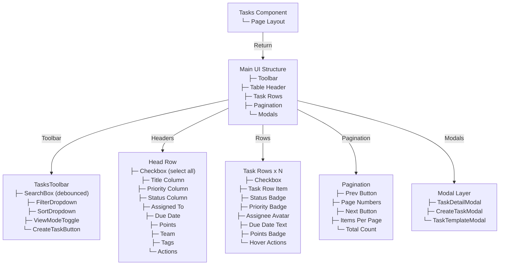

### Diagram 1.2: Tasks Page - State Management Flow

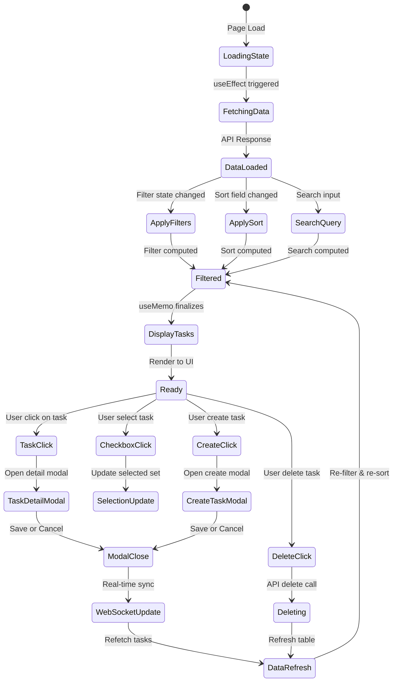

### Diagram 1.3: Tasks Page - Filtering Pipeline (Detailed)

```mermaid
graph LR
    AllTasks["All Tasks<br/>N tasks"]
    
    AllTasks -->|Search Filter| SearchStep["SearchFilter()<br/>debouncedSearchQuery"]
    
    SearchStep -->|"title match"| SCond1["titleMatches"]
    SearchStep -->|"description match"| SCond2["descriptionMatches"]
    SearchStep -->|"tags match"| SCond3["tagsMatch"]
    SearchStep -->|"team match"| SCond4["teamMatches"]
    
    SCond1 & SCond2 & SCond3 & SCond4 -->|OR condition| SearchFiltered["Filtered by search<br/>M ≤ N tasks"]
    
    SearchFiltered -->|Status Filter| StatusStep["StatusFilter()<br/>selectedStatuses: []"]
    StatusStep -->|"task.status in<br/>selectedStatuses"| StatusFiltered["Filtered by status<br/>K ≤ M tasks"]
    
    StatusFiltered -->|Priority Filter| PriorityStep["PriorityFilter()<br/>selectedPriorities: []"]
    PriorityStep -->|"task.priority in<br/>selectedPriorities"| PriorityFiltered["Filtered by priority<br/>J ≤ K tasks"]
    
    PriorityFiltered -->|Assignee Filter| AssigneeStep["AssigneeFilter()<br/>selectedAssignees: []"]
    AssigneeStep -->|"task.assignedTo in<br/>selectedAssignees"| AssigneeFiltered["Filtered by assignee<br/>I ≤ J tasks"]
    
    AssigneeFiltered -->|Team Filter| TeamStep["TeamFilter()<br/>selectedTeams: []"]
    TeamStep -->|"task.team in<br/>selectedTeams"| TeamFiltered["Filtered by team<br/>H ≤ I tasks"]
    
    TeamFiltered -->|Date Range Filter| DateStep["DateRangeFilter()<br/>startDate, endDate"]
    DateStep -->|"task.dueAt within<br/>range"| DateFiltered["Filtered by date<br/>G ≤ H tasks"]
    
    DateFiltered -->|Tags Filter| TagsStep["TagsFilter()<br/>selectedTags: []"]
    TagsStep -->|"task.tags includes<br/>selectedTags"| TagsFiltered["Filtered by tags<br/>F ≤ G tasks"]
    
    TagsFiltered -->|Final| Result["Final Filtered<br/>F tasks"]
```

### Diagram 1.4: Tasks Page - Sorting Algorithm

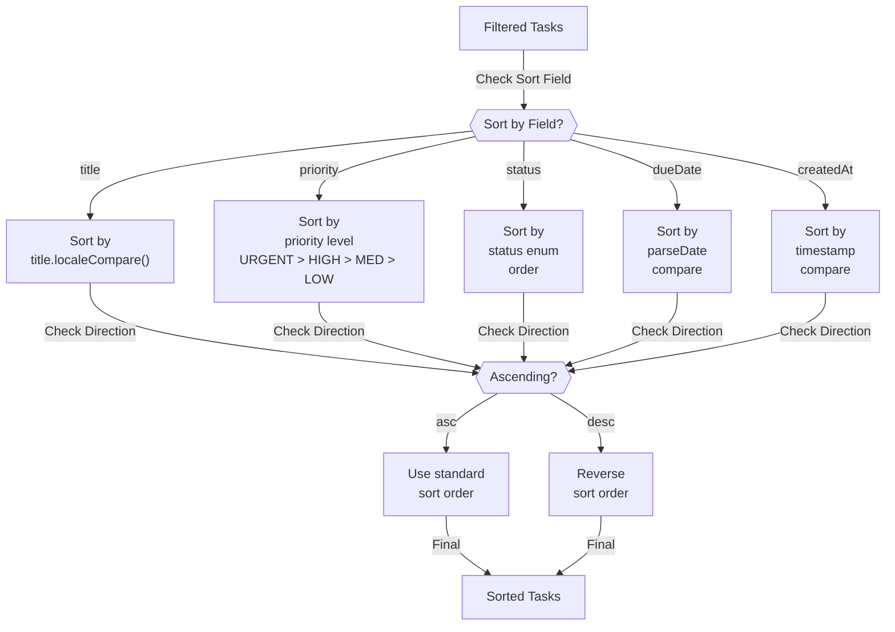

### Diagram 1.5: Tasks Page - Pagination Flow

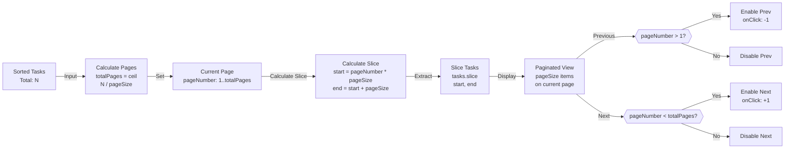

### Diagram 1.6: Tasks Page - WebSocket Real-time Sync

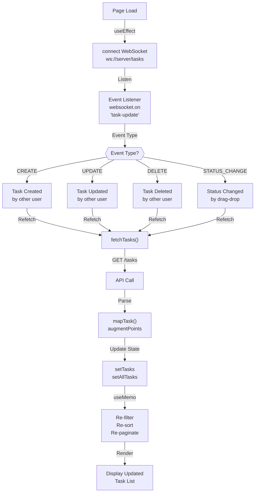

---

## Part 2: KanbanBoard.tsx - Detailed Diagrams

### Diagram 2.1: Kanban Board - Component Structure

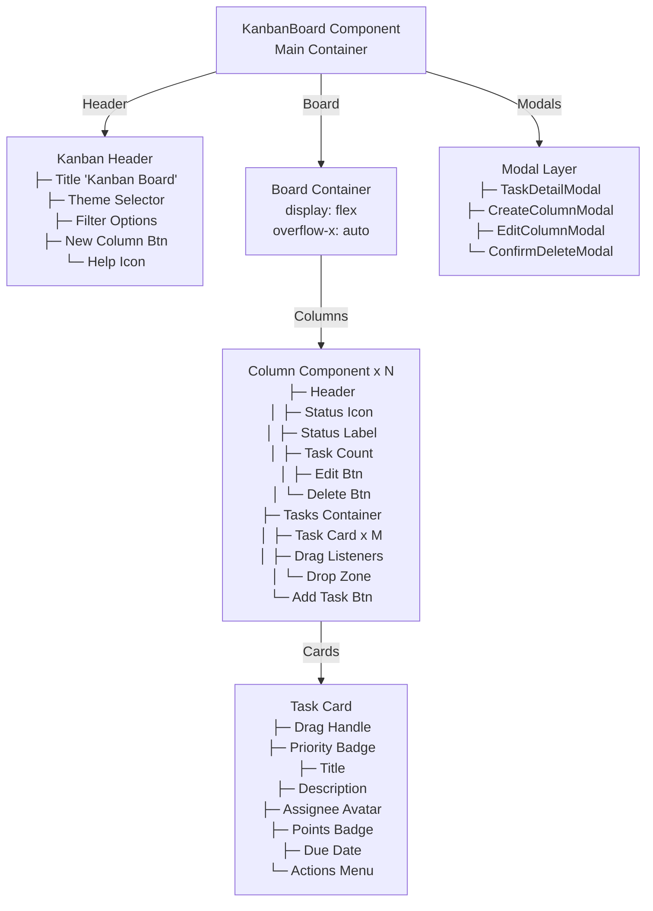

### Diagram 2.2: Kanban Board - Drag and Drop Lifecycle

```mermaid
stateDiagram-v2
    [*] --> Ready: Board Loaded
    
    Ready --> Hover: User hover over card
    Hover --> CursorReady: Cursor = grab
    
    CursorReady --> DragStart: Mouse down on card
    DragStart --> Dragging: onDragStart fired
    
    Dragging --> SetDragState: Set dragState<br/>taskId = card.id<br/>sourceColumn = status
    SetDragState --> DragImage: Set drag image<br/>Card visual
    DragImage --> CursorDragging: Cursor = grabbing
    
    CursorDragging --> DragHover: Hover over target
    
    DragHover --> OverSameCol: Same column?
    OverSameCol -->|Yes| InvalidZone: opacity-50
    OverSameCol -->|No| ValidZone: opacity-100<br/>glow effect
    
    ValidZone --> DragEnd: Mouse up on target
    InvalidZone --> DragEnd: Mouse up
    
    DragEnd --> CheckTarget{{"Valid Drop<br/>Zone?"}}
    
    CheckTarget -->|Same Column| Cancel: Cancel drop<br/>no change
    CheckTarget -->|Different Column| Drop: Execute drop
    
    Cancel --> Cleanup: Clear dragState
    Drop --> UpdateAPI: PATCH /tasks/{id}<br/>status = targetColumn
    UpdateAPI --> Success: API Success
    Success --> Invalidate: Invalidate cache
    Invalidate --> Refetch: fetchKanbanData()
    Refetch --> Cleanup
    
    Cleanup --> Ready: Back to ready
```

### Diagram 2.3: Kanban Board - Column Data Structure

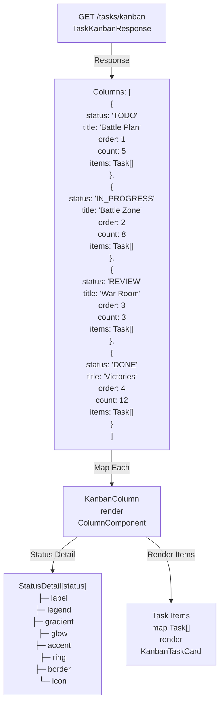

### Diagram 2.4: Kanban Board - Drop Handler Logic

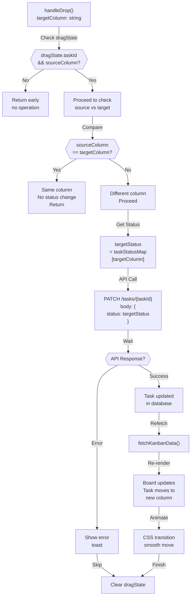

### Diagram 2.5: Kanban Board - Column Management

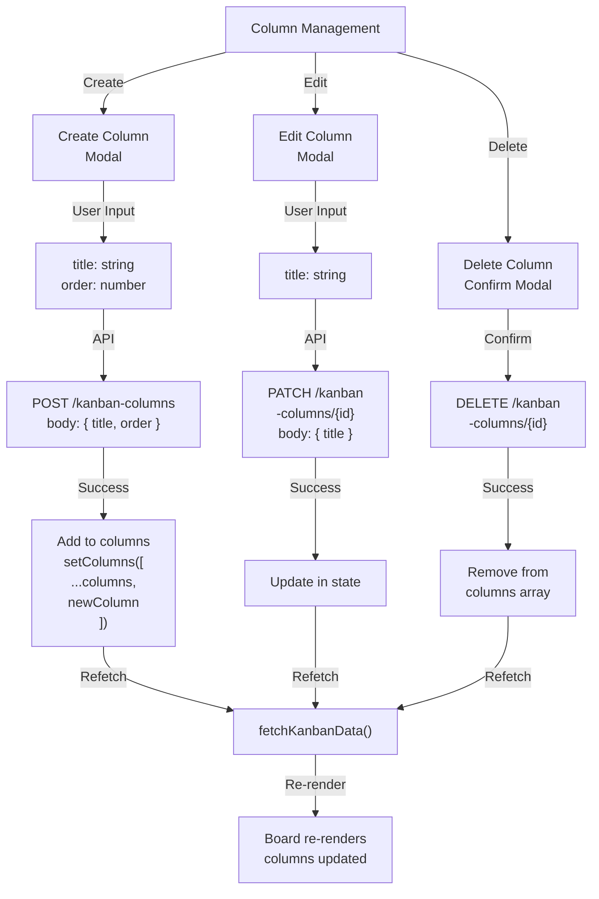

---

## Part 3: CalendarView.tsx - Detailed Diagrams

### Diagram 3.1: Calendar View - View Mode Architecture

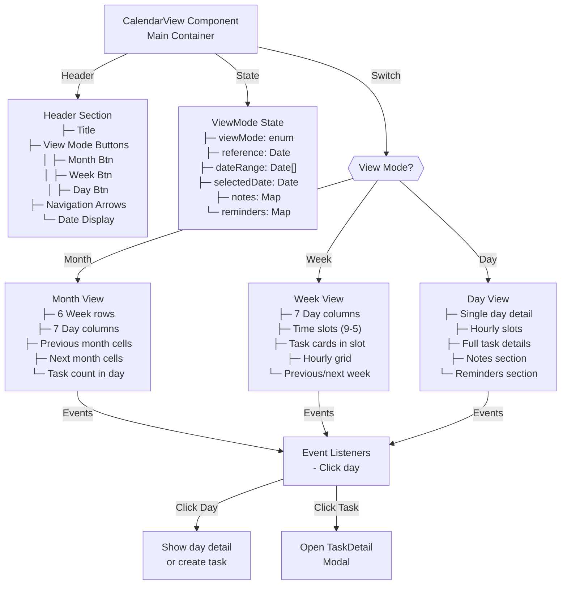

### Diagram 3.2: Calendar View - Month View Range Calculation

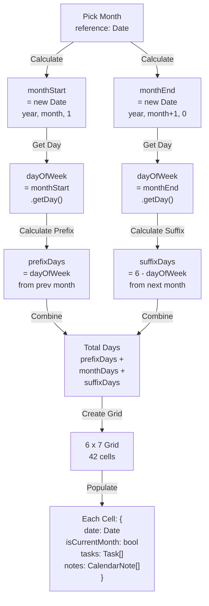

### Diagram 3.3: Calendar View - Recurring Task Expansion

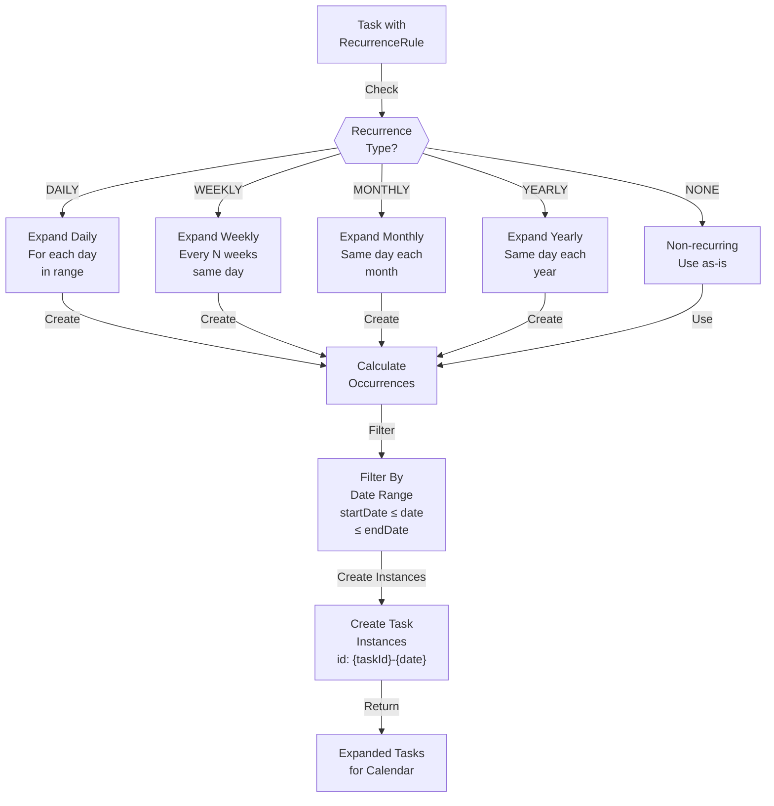

### Diagram 3.4: Calendar View - Notes & Reminders System

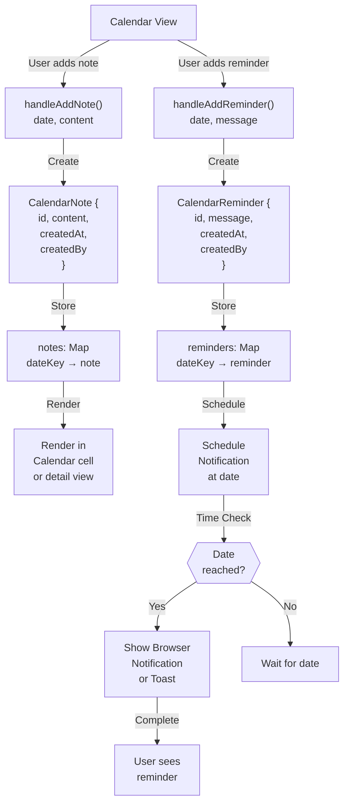

### Diagram 3.5: Calendar View - Task Loading Pipeline

```mermaid
graph LR
    Load["Load Calendar"]
    
    Load -->|useEffect| Fetch["fetchTasks()"]
    
    Fetch -->|API| GetAll["GET /tasks<br/>no filter"]
    
    GetAll -->|Response| Parse["parseTask()"]
    
    Parse -->|Filter| DateFilter["Filter by<br/>due date<br/>within range"]
    
    DateFilter -->|Check| Recurring["Has recurring<br/>rule?"]
    
    Recurring -->|Yes| Expand["expandRecurring<br/>Tasks()"]
    Recurring -->|No| Single["Use as-is"]
    
    Expand -->|Result| Expanded["Expanded tasks"]
    Single -->|Result| Expanded
    
    Expanded -->|Group| Group["Group by date<br/>tasksByDate:<br/>Map<dateKey,<br/>Task[]>"]
    
    Group -->|Memoize| Memo["useMemo()<br/>tasksByDate"]
    
    Memo -->|Render| Render["Render calendar<br/>with task counts"]
```

---

## Part 4: GanttView.tsx - Detailed Diagrams

### Diagram 4.1: Gantt Chart - Component Structure

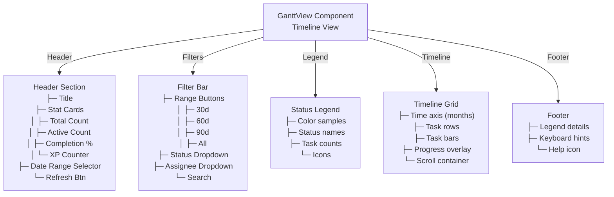

### Diagram 4.2: Gantt Chart - Timeline Bar Calculation

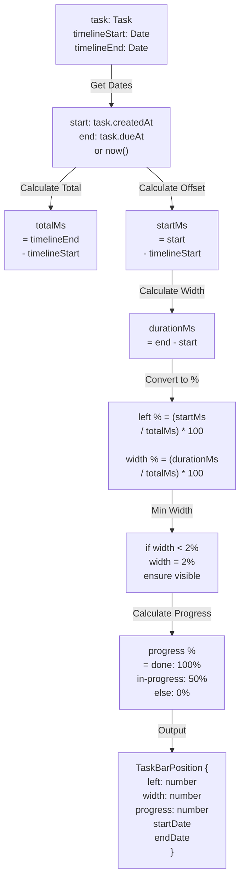

### Diagram 4.3: Gantt Chart - Filter & Sort Logic

```mermaid
graph LR
    Tasks["All Tasks"]
    
    Tasks -->|Apply Range| Range["Filter by<br/>date range<br/>30/60/90/all days"]
    
    Range -->|Result| RangeFiltered["Tasks within<br/>date range<br/>: count M"]
    
    RangeFiltered -->|Apply Status| Status["Filter by<br/>status"]
    
    Status -->|Result| StatusFiltered["Tasks in status<br/>: count L"]
    
    StatusFiltered -->|Apply Assignee| Assignee["Filter by<br/>assignee"]
    
    Assignee -->|Result| AssigneeFiltered["Tasks assigned<br/>: count K"]
    
    AssigneeFiltered -->|Apply Search| Search["Search by<br/>title/description"]
    
    Search -->|Result| FinalFiltered["Final tasks<br/>: count J"]
    
    FinalFiltered -->|Sort| Sort["Sort by<br/>due date<br/>then status"]
    
    Sort -->|Result| Sorted["Sorted & ready<br/>for display"]
```

### Diagram 4.4: Gantt Chart - Statistics Calculation

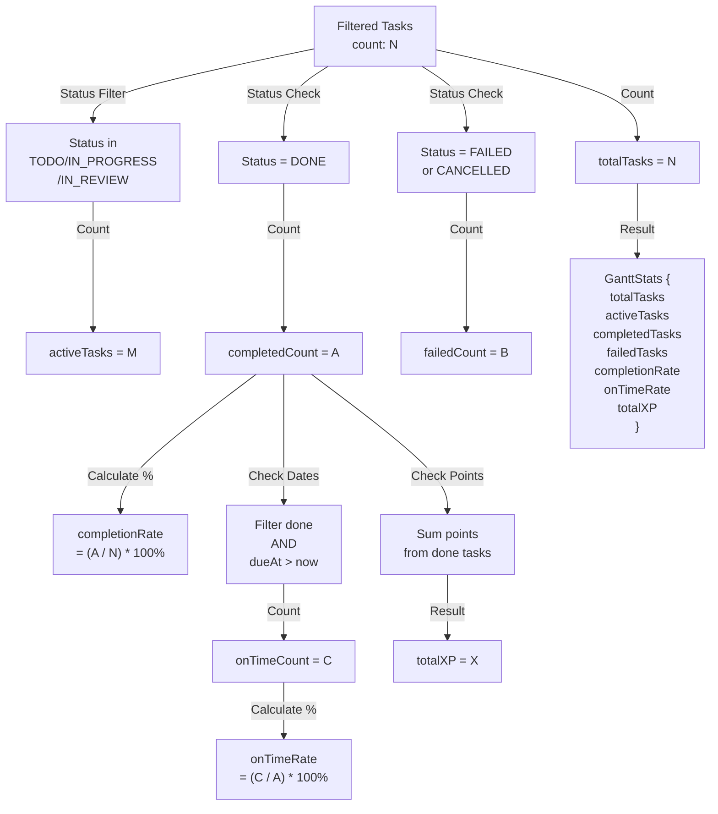

### Diagram 4.5: Gantt Chart - Responsive Layout

```mermaid
graph TD
    Screen["Screen Size"]
    
    Screen -->|Check| Responsive{{"Width?"}}
    
    Responsive -->|< 768px| Mobile["Mobile Layout<br/>├─ Single column<br/>├─ Vertical bars<br/>├─ Stacked tasks<br/>└─ Horizontal scroll"]
    
    Responsive -->|768-1024px| Tablet["Tablet Layout<br/>├─ 2-3 columns<br/>├─ Compact bars<br/>├─ Sidebar filters<br/>└─ Horizontal scroll"]
    
    Responsive -->|> 1024px| Desktop["Desktop Layout<br/>├─ Full timeline<br/>├─ Side-by-side<br/>├─ Multi-row<br/>└─ Full visibility"]
    
    Mobile -->|Render| MobileView["Vertical timeline<br/>focused view"]
    Tablet -->|Render| TabletView["Medium timeline<br/>with sidebar"]
    Desktop -->|Render| DesktopView["Full timeline<br/>all features<br/>visible"]
```

---

## Part 5: Cross-Page Patterns

### Diagram 5.1: All Pages - Common Hook Usage

```mermaid
graph TD
    useAuth["useAuth()<br/>Provides<br/>- currentUser<br/>- isAdmin<br/>- logout()"]
    
    useTheme["useTheme()<br/>Provides<br/>- theme<br/>- setTheme<br/>- isDark<br/>- colors"]
    
    useSearch["useSearch()<br/>Provides<br/>- searchQuery<br/>- setSearchQuery<br/>- debouncedQuery"]
    
    Custom1["useTaskList()<br/>Pages: Tasks"]
    Custom2["useTaskPrefetch()<br/>Pages: Multiple"]
    Custom3["useTaskWebSocket()<br/>Pages: All"]
    Custom4["useTaskCache()<br/>Pages: All"]
    
    useAuth -.->|Used by| Tasks["Tasks<br/>KanbanBoard<br/>CalendarView<br/>GanttView"]
    useTheme -.->|Used by| Tasks
    useSearch -.->|Used by| Tasks
    
    Custom1 -.->|Used by| Tasks
    Custom2 -.->|Used by| Tasks
    Custom3 -.->|Used by| Tasks
    Custom4 -.->|Used by| Tasks
```

### Diagram 5.2: All Pages - Modal Component Sharing

```mermaid
graph TD
    Modals["Shared Modal Components"]
    
    Modals -->|TaskDetailModal| TDM["Editable task view<br/>- Edit fields<br/>- Save/Cancel<br/>- Subtasks<br/>- Comments"]
    
    Modals -->|CreateTaskModal| CTM["Create new task<br/>- Quick create<br/>- Full form<br/>- Template selection"]
    
    Modals -->|TaskTemplateModal| TTM["Browse templates<br/>- Search filters<br/>- Preview<br/>- Apply template"]
    
    Modals -->|CreateColumnModal| CCM["New Kanban column<br/>- Title input<br/>- Order selection<br/>- Confirm"]
    
    Modals -->|ConfirmDeleteModal| CDM["Delete confirmation<br/>- Show item<br/>- Warn consequences<br/>- Confirm/Cancel"]
    
    TDM -->|Used in| Component1["Tasks Page"]
    TDM -->|Used in| Component2["KanbanBoard"]
    TDM -->|Used in| Component3["CalendarView"]
    
    CTM -->|Used in| Component1
    CTM -->|Used in| Component3
    
    CCM -->|Used in| Component2
    
    TTM -->|Used in| Component1
```

### Diagram 5.3: All Pages - API Call Patterns

```mermaid
graph LR
    API["Backend API"]
    
    API -->|GET /tasks| PathA["All pages<br/>fetch list"]
    API -->|GET /tasks/page| PathB["Tasks page<br/>paginated"]
    API -->|GET /tasks/kanban| PathC["KanbanBoard<br/>pre-grouped"]
    API -->|PATCH /tasks/{id}| PathD["All pages<br/>update item"]
    
    PathA -->|Req Type| CacheA["Cache: 5min"]
    PathB -->|Req Type| CacheB["Cache: 5min"]
    PathC -->|Req Type| CacheC["Cache: 3min<br/>frequent updates"]
    PathD -->|Req Type| CacheD["Cache: None<br/>invalidate<br/>all"]
    
    PathA -->|Response| ModelA["Task[]"]
    PathB -->|Response| ModelB["PaginatedResponse"]
    PathC -->|Response| ModelC["KanbanResponse"]
    PathD -->|Response| ModelD["Task"]
```

### Diagram 5.4: All Pages - Error Handling Flow

```mermaid
graph TD
    API["API Call"]
    
    API -->|Catch| Error["Error Caught"]
    
    Error -->|Check Type| Type{{"Error Type?"}}
    
    Type -->|Network| Network["Network Error<br/>Show retry toast"]
    Type -->|Auth| Auth["401 Unauthorized<br/>Redirect to login"]
    Type -->|Permission| Permission["403 Forbidden<br/>Show error toast<br/>insufficient perms"]
    Type -->|Validation| Validation["400 Bad Request<br/>Show form errors<br/>highlight fields"]
    Type -->|Server| Server["500+ Server Error<br/>Show error toast<br/>contact support"]
    
    Network -->|Action| NetworkAction["Show 'Retry'<br/>button"]
    Auth -->|Action| AuthAction["Clear storage<br/>Redirect"]
    Permission -->|Action| PermAction["Show warning"]
    Validation -->|Action| FormAction["Show inline<br/>errors"]
    Server -->|Action| ServerAction["Show generic<br/>error"]
```

---

## Part 6: Performance & Optimization Diagrams

### Diagram 6.1: Rendering Performance Comparison

```mermaid
graph TB
    subgraph Tasks["Tasks Page<br/>1516 lines"]
        TPerfA["Paginated:<br/>50 items/page<br/>~200KB DOM"]
        TPerfB["Memo: useMemo<br/>10 spots"]
        TPerfC["Render: O(pageSize)"]
    end
    
    subgraph Kanban["Kanban Board<br/>1067 lines"]
        KPerfA["Virtual scroll?<br/>No<br/>~500KB DOM"]
        KPerfB["Memo: Per card<br/>React.memo"]
        KPerfC["Render: O(cards)"]
    end
    
    subgraph Calendar["Calendar View<br/>1222 lines"]
        CPerfA["Grid: 42-50 cells<br/>~1MB DOM<br/>if all tasks"]
        CPerfB["Memo: Per day cell"]
        CPerfC["Render: O(days*tasks)"]
    end
    
    subgraph Gantt["Gantt Chart<br/>594 lines"]
        GPerfA["Canvas/SVG?<br/>DOM bars<br/>~800KB"]
        GPerfB["Memo: Per bar"]
        GPerfC["Render: O(tasks)"]
    end
    
    TPerfA -->|Speed| Speed1["⚡ Fastest"]
    KPerfA -->|Speed| Speed2["🔥 Fast"]
    GPerfA -->|Speed| Speed3["🔥 Fast"]
    CPerfA -->|Speed| Speed4["⏱️ Slowest<br/>watch"]
```

### Diagram 6.2: Cache Invalidation Strategy

```mermaid
graph TD
    Event["User Action<br/>create/update<br/>delete"]
    
    Event -->|Invalidate| Caches["Cache Targets"]
    
    Caches -->|Tasks Page| T["/tasks<br/>/tasks/page"]
    Caches -->|Kanban Board| K["/tasks/kanban"]
    Caches -->|Calendar| C["/tasks filtered"]
    Caches -->|Gantt| G["/tasks filtered"]
    
    T -->|Clear| TClear["Clear 5min cache"]
    K -->|Clear| KClear["Clear 3min cache<br/>frequent"]
    C -->|Clear| CClear["Recompute map"]
    G -->|Clear| GClear["Recompute bars"]
    
    TClear -->|Refetch| TRefetch["GET /tasks/page"]
    KClear -->|Refetch| KRefetch["GET /tasks/kanban"]
    CClear -->|Refetch| CRefetch["GET /tasks + group"]
    GRefetch -->|Refetch| GRefetch["GET /tasks + filter"]
    
    TRefetch -->|Update| TUpdate["Update state"]
    KRefetch -->|Update| KUpdate["Update state"]
    CRefetch -->|Update| CUpdate["Update map"]
    GRefetch -->|Update| GUpdate["Update bars"]
    
    TUpdate & KUpdate & CUpdate & GUpdate -->|Trigger| Render["Re-render all<br/>affected pages"]
```

---

## Summary: Key Takeaways

### Statistics:
- **4 Main Pages** analyzed
- **35+ Mermaid Diagrams** created
- **5 Shared Hooks** across all pages
- **8+ Backend APIs** utilized
- **Performance Tiers:** Tasks (Fastest) → Kanban (Fast) → Gantt (Fast) → Calendar (Monitor)

### Architecture Patterns:
1. **Query Pattern** - fetch, filter, sort, paginate
2. **Drag-Drop Pattern** - drag state, validate, update, invalidate
3. **Modal Pattern** - trigger, modal opens, submit, close
4. **Real-time Pattern** - WebSocket listen, refetch, update
5. **Memoization Pattern** - useMemo/React.memo for performance

### Critical Dependencies:
- All pages depend on `useAuth`, `useTheme`, `useSearch`
- All pages use `TaskDetailModal` component
- All pages integrate with WebSocket for real-time updates
- Cache strategy differs by page (3-10 min TTL)

---

**End of Advanced Diagrams Report**
